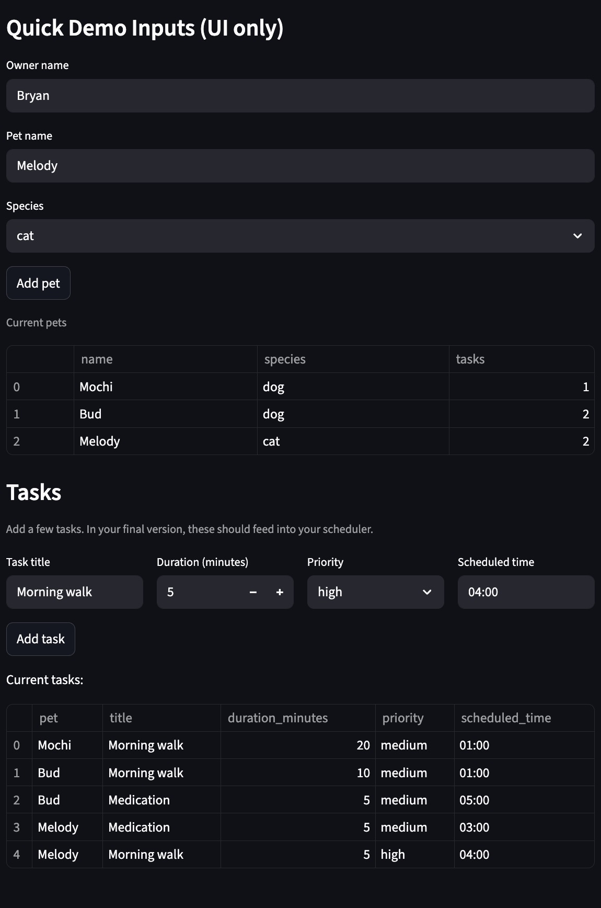
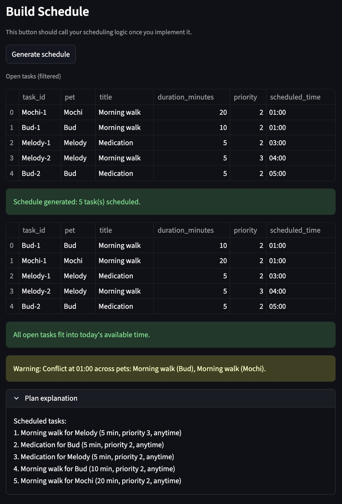

# PawPal+ (Module 2 Project)

You are building **PawPal+**, a Streamlit app that helps a pet owner plan care tasks for their pet.

## Scenario

A busy pet owner needs help staying consistent with pet care. They want an assistant that can:

- Track pet care tasks (walks, feeding, meds, enrichment, grooming, etc.)
- Consider constraints (time available, priority, owner preferences)
- Produce a daily plan and explain why it chose that plan

Your job is to design the system first (UML), then implement the logic in Python, then connect it to the Streamlit UI.

## What you will build

Your final app should:

- Let a user enter basic owner + pet info
- Let a user add/edit tasks (duration + priority at minimum)
- Generate a daily schedule/plan based on constraints and priorities
- Display the plan clearly (and ideally explain the reasoning)
- Include tests for the most important scheduling behaviors

## Features

- Priority-based planning under a daily time budget: pending tasks are ranked by computed priority score, owner time-window preference, task duration, and title; tasks are then scheduled greedily until available minutes are used.
- Priority scoring heuristic: each task score combines base priority, a bonus for required tasks, and a small tie-break boost for shorter tasks.
- Owner preference-aware scheduling: tasks in preferred windows are ranked ahead of non-preferred or unspecified windows.
- Sorting by time (`HH:MM`): tasks can be sorted by `scheduled_time`, with missing times safely placed last and invalid formats validated.
- Task filtering: tasks can be filtered by completion state (`is_completed`) and/or pet name (case-insensitive).
- Daily and weekly recurrence: completing a `daily` or `weekly` task auto-generates the next occurrence with a new due date and unique task ID.
- Conflict warnings (non-crashing): same-time task collisions generate warning messages, including cross-pet conflicts and invalid `scheduled_time` values.
- Plan explainability: generated output distinguishes scheduled vs. unscheduled tasks and reports unscheduled items when time is insufficient.
- Multi-source task deduplication: scheduler-visible tasks are merged and deduplicated by `task_id` across owner, pet, and direct scheduler task lists.

## Screenshots
<a href="images/screenshot-1.jpg" target="_blank"></a>
<a href="images/screenshot-2.jpg" target="_blank"></a>


## Smarter Scheduling

Recent updates add practical scheduling behavior beyond basic sorting:

- Time sorting: tasks can be sorted by `scheduled_time` in `HH:MM` format, with missing times safely placed last.
- Task filtering: tasks can be filtered by completion status and/or pet name.
- Recurring tasks: completing `daily` or `weekly` tasks automatically creates the next occurrence with a new due date.
- Conflict warnings: the scheduler can detect tasks that share the same time and return warning messages instead of crashing.

## Getting started

### Setup

```bash
python -m venv .venv
source .venv/bin/activate  # Windows: .venv\Scripts\activate
pip install -r requirements.txt
```

### Suggested workflow

1. Read the scenario carefully and identify requirements and edge cases.
2. Draft a UML diagram (classes, attributes, methods, relationships).
3. Convert UML into Python class stubs (no logic yet).
4. Implement scheduling logic in small increments.
5. Add tests to verify key behaviors.
6. Connect your logic to the Streamlit UI in `app.py`.
7. Refine UML so it matches what you actually built.
